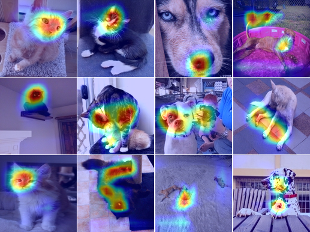

# Class Activation Map, Keras

Image classification + CAM with keras

## Requirements

- python 2.7
- OpenCV 3.2.0
- pandas
- numpy
- [Keras 2.0.7](https://github.com/fchollet/keras)
- [TensorFlow 1.3.0](https://github.com/tensorflow/tensorflow)

## Usage  

Input data(only for evaluation)

    └── data
        └── validation
            └── cat
                └── xxx.png (name doesn't matter)
            └── dog    
                └── xxx.png (name doesn't matter)

The dataset directory structure is followed to use the Keras DataGen Framework.

checkpoint files,
    
    └── checkpoint
        └── (ckpt_name)
            ├── model.json 
            ├── weight.xx.h5
            └── ...

To test a model

    $ python main.py --mode cam --ckpt_name weight --data_path ./data/validation --batch_size 10

